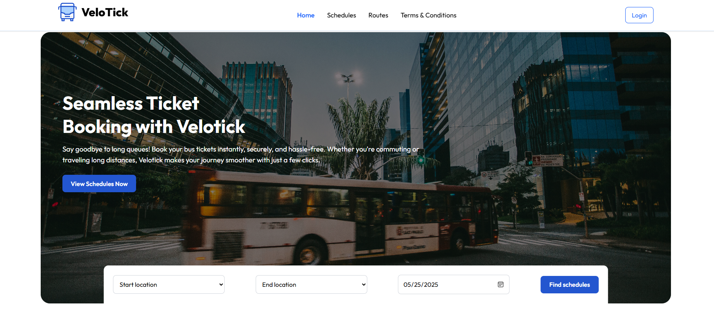

# 🚍 Velotick Frontend – Digital Cross-Border Bus Booking Platform

Velotick is the frontend component of a digital cross-border transportation platform for Rwanda and neighboring countries. This project provides a user-friendly **web interface** for passengers and transport company staff to **book, manage, and verify bus tickets**. The application is built using **React.js** and styled with **Tailwind CSS**.

## 📑 Project Overview

This frontend app is part of the larger project titled:

> **Digital Transformation of Cross-Border Transportation Services in Rwanda**

The platform aims to:
- Replace manual ticketing with a digital system.
- Support multiple transportation companies .
- Provide real-time seat availability and secure ticket verification.

## 🌐 Tech Stack

- **React.js** – Frontend library for building UI components.
- **Tailwind CSS** – Utility-first CSS framework for styling.
- **React Router** – For routing between pages.
- **Axios** – For API calls to the backend.
- **QR Code Generator/Scanner Libraries** – For ticket verification.
### 🏠 Homepage View

## 🚀 Getting Started

1. Clone the repository:
   
   git clone  https://github.com/Muhinde234/Velotick-fn.git
   

2. Navigate to the project directory:
   
   cd Velotick-fn
   

3. Install dependencies:
   
   npm install
   

4. Start the development server:
   
   npm  run dev

5. Open your browser and navigate to `http://localhost:3000` to see the application.

